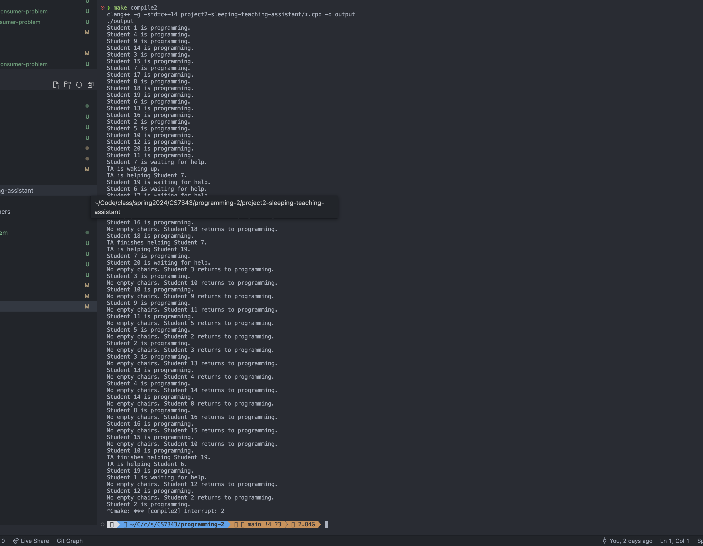
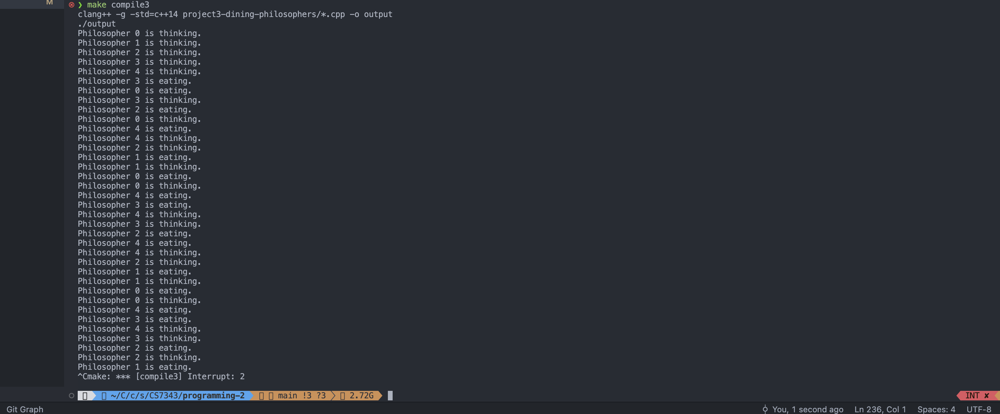
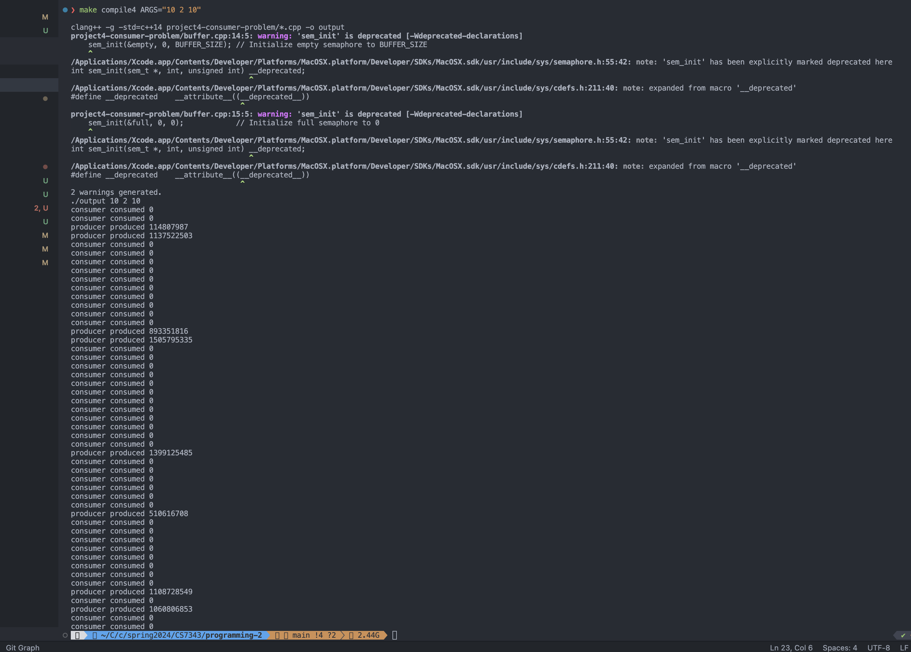

For each project, please submit
1. The source code of the project
2. Brief description of how to test your program
3. A sample Output (snapshot or a video of program running)


### Project 2: The Sleeping Teaching Assistant
A university computer science department has a teaching assistant (TA) who helps undergraduate students with their programming assignments during regular office hours. The TA's office is rather small and has room for only one desk with a chair and computer. There are three chairs in the hallway outside the office where students can sit and wait if the TA is currently helping another student. When there are no students who need help during office hours, the TA sits at the desk and takes a nap. If a student arrives during office hours and finds the TA sleeping, the student must awaken the TA to ask for help. If a student arrives and finds the TA currently helping another student, the student sits on one of the chairs in the hallway and waits. If no chairs are available, the student will come back at a later time.
Using POSIX threads, mutex locks, and semaphores, implement a solu- tion that coordinates the activities of the TA and the students. Details for this assignment are provided below.
The Students and the TA
Using Pthreads (Section 4.4.1), begin by creating n students where each student will run as a separate thread. The TA will run as a separate thread as well. Student threads will alternate between programming for a period of time and seeking help from the TA. If the TA is available, they will obtain help. Otherwise, they will either sit in a chair in the hallway or, if no chairs are available, will resume programming and will seek help at a later time. If a student arrives and notices that the TA is sleeping, the student must notify the TA using a semaphore. When the TA finishes helping a student, the TA must check to see if there are students waiting for help in the hallway. If so, the TA must help each of these students in turn. If no students are present, the TA may return to napping.
Perhaps the best option for simulating students programming—as well as the TA providing help to a student—is to have the appropriate threads sleep for a random period of time.
Coverage of POSIX mutex locks and semaphores is provided in Section 7.3. Consult that section for details.


run ```make compile2```

This example is n = 20 students with 3 chairs. You can modify accorindingly in project2-sleeping-teaching-assistant/main.cpp

Output: 
```
make compile2
clang++ -g -std=c++14 project2-sleeping-teaching-assistant/*.cpp -o output
./output
Student 1 is programming.
Student 4 is programming.
Student 9 is programming.
Student 14 is programming.
Student 3 is programming.
Student 15 is programming.
Student 7 is programming.
Student 17 is programming.
Student 8 is programming.
Student 18 is programming.
Student 19 is programming.
Student 6 is programming.
Student 13 is programming.
Student 16 is programming.
Student 2 is programming.
Student 5 is programming.
Student 10 is programming.
Student 12 is programming.
Student 20 is programming.
Student 11 is programming.
Student 7 is waiting for help.
TA is waking up.
TA is helping Student 7.
Student 19 is waiting for help.
Student 6 is waiting for help.
Student 17 is waiting for help.
No empty chairs. Student 20 returns to programming.
Student 20 is programming.
No empty chairs. Student 16 returns to programming.
Student 16 is programming.
No empty chairs. Student 18 returns to programming.
Student 18 is programming.
TA finishes helping Student 7.
TA is helping Student 19.
Student 7 is programming.
Student 20 is waiting for help.
No empty chairs. Student 3 returns to programming.
Student 3 is programming.
No empty chairs. Student 10 returns to programming.
Student 10 is programming.
No empty chairs. Student 9 returns to programming.
Student 9 is programming.
No empty chairs. Student 11 returns to programming.
Student 11 is programming.
No empty chairs. Student 5 returns to programming.
Student 5 is programming.
No empty chairs. Student 2 returns to programming.
Student 2 is programming.
No empty chairs. Student 3 returns to programming.
Student 3 is programming.
No empty chairs. Student 13 returns to programming.
Student 13 is programming.
No empty chairs. Student 4 returns to programming.
Student 4 is programming.
No empty chairs. Student 14 returns to programming.
Student 14 is programming.
No empty chairs. Student 8 returns to programming.
Student 8 is programming.
No empty chairs. Student 16 returns to programming.
Student 16 is programming.
No empty chairs. Student 15 returns to programming.
Student 15 is programming.
No empty chairs. Student 10 returns to programming.
Student 10 is programming.
TA finishes helping Student 19.
TA is helping Student 6.
Student 19 is programming.
Student 1 is waiting for help.
No empty chairs. Student 12 returns to programming.
Student 12 is programming.
No empty chairs. Student 2 returns to programming.
Student 2 is programming.
^Cmake: *** [compile2] Interrupt: 2
```

### Project 3: The Dining-Philosophers Problem
Dining-Philosophers Problem Outline:
Consider five philosophers who spend their lives thinking and eating. The philosophers share a circular table surrounded by five chairs, each belonging to one philosopher. In the center of the table is a bowl of rice, and the table is laid with five single chopsticks (Figure 7.5). When a philosopher thinks, she does not interact with her colleagues. From time to time, a philosopher gets hungry and tries to pick up the two chopsticks that are closest to her (the chopsticks that are between her and her left and right neighbors). A philosopher may pick up only one chopstick at a time. Obviously, she cannot pick up a chopstick that is already in the hand of a neighbor. When a hungry philosopher has both her chopsticks at the same time, she eats without releasing the chopsticks. When she is finished eating, she puts down both chopsticks and starts thinking again. The dining-philosophers problem is considered a classic synchronization problem neither because of its practical importance nor because computer scientists dislike philosophers but because it is an example of a large class of concurrency-control problems. It is a simple representation of the need

In Section 7.1.3, we provide an outline of a solution to the dining-philosophers problem using monitors. This project involves implementing a solution to this problem using either POSIX mutex locks and condition variables or Java condition variables. Solutions will be based on the algorithm illustrated in Figure 7.7. Both implementations will require creating five philosophers, each identified by a number 0 .. 4. Each philosopher will run as a separate thread. Philosophers alternate between thinking and eating. To simulate both activities, have each thread sleep for a random period between one and three seconds.

I. POSIX
Thread creation using Pthreads is covered in Section 4.4.1. When a philosopher wishes to eat, she invokes the function pickup forks (int philosopher_number) where philosopher_number identifies the number of the philosopher wishing to eat. When a philosopher finishes eating, she invokes return_forks (int philosopher_number)
Your implementation will require the use of POSIX condition variables, which are covered in Section 7.3.


run ```make compile3```

Output: 

```
Philosopher 0 is thinking.
Philosopher 1 is thinking.
Philosopher 2 is thinking.
Philosopher 3 is thinking.
Philosopher 4 is thinking.
Philosopher 3 is eating.
Philosopher 0 is eating.
Philosopher 3 is thinking.
Philosopher 2 is eating.
Philosopher 0 is thinking.
Philosopher 4 is eating.
Philosopher 4 is thinking.
Philosopher 2 is thinking.
Philosopher 1 is eating.
Philosopher 1 is thinking.
Philosopher 0 is eating.
Philosopher 0 is thinking.
Philosopher 4 is eating.
Philosopher 3 is eating.
Philosopher 4 is thinking.
Philosopher 3 is thinking.
Philosopher 2 is eating.
Philosopher 4 is eating.
Philosopher 4 is thinking.
Philosopher 2 is thinking.
Philosopher 1 is eating.
Philosopher 1 is thinking.
Philosopher 0 is eating.
Philosopher 0 is thinking.
Philosopher 4 is eating.
Philosopher 3 is eating.
Philosopher 4 is thinking.
Philosopher 3 is thinking.
Philosopher 2 is eating.
Philosopher 2 is thinking.
Philosopher 1 is eating.
```


### Project 4: The Producer - Consumer Problem
In Section 7.1.1, we presented a semaphore-based solution to the producer-consumer problem using a bounded buffer. In this project, you will design a programming solution to the bounded-buffer problem using the producer and consumer processes shown in Figures 5.9 and 5.10. The solution presented in Section 7.1.1 uses three semaphores: empty and full, which count the number of empty and full slots in the buffer, and mutex, which is a binary (or mutual- exclusion) semaphore that protects the actual insertion or removal of items in the buffer. For this project, you will use standard counting semaphores for empty and full and a mutex lock, rather than a binary semaphore, to represent mutex. The producer and consumer-running as separate threads —will move items to and from a buffer that is synchronized with the empty, full, and mutex structures. You can solve this problem using either Pthreads or the Windows API.

run ```make compile4 ARGS="10 2 10"```

Output: 

```
consumer consumed 0
consumer consumed 0
producer produced 114807987
producer produced 1137522503
consumer consumed 0
consumer consumed 0
consumer consumed 0
consumer consumed 0
consumer consumed 0
consumer consumed 0
consumer consumed 0
consumer consumed 0
consumer consumed 0
consumer consumed 0
producer produced 893351816
producer produced 1505795335
consumer consumed 0
consumer consumed 0
consumer consumed 0
consumer consumed 0
consumer consumed 0
consumer consumed 0
consumer consumed 0
consumer consumed 0
consumer consumed 0
consumer consumed 0
consumer consumed 0
consumer consumed 0
producer produced 1399125485
consumer consumed 0
consumer consumed 0
consumer consumed 0
consumer consumed 0
consumer consumed 0
consumer consumed 0
producer produced 510616708
consumer consumed 0
consumer consumed 0
consumer consumed 0
consumer consumed 0
consumer consumed 0
consumer consumed 0
consumer consumed 0
consumer consumed 0
producer produced 1108728549
consumer consumed 0
producer produced 1060806853
consumer consumed 0
consumer consumed 0
```
